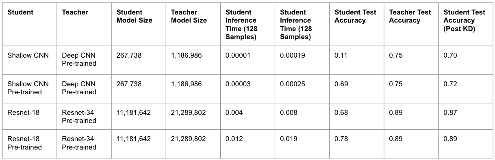
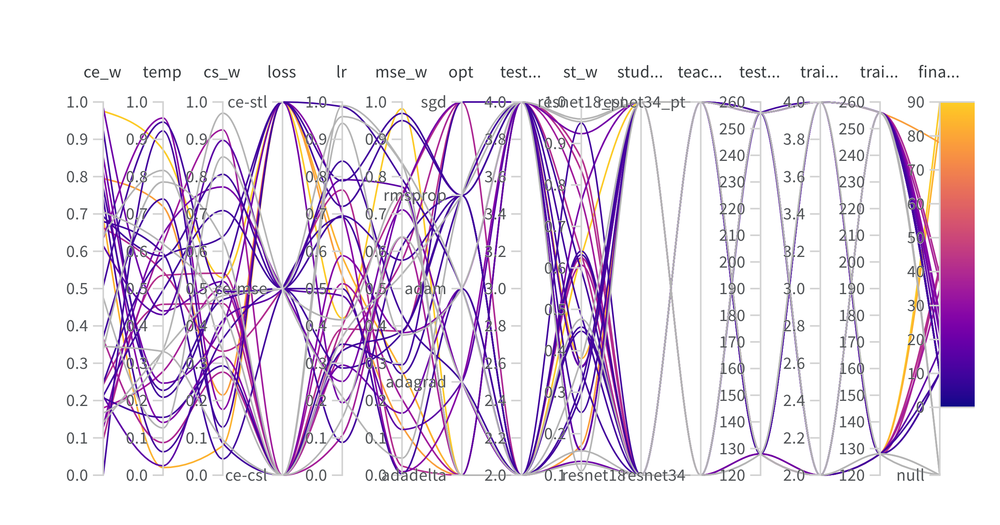

# Knowledge Distillation Experiments

## Project Description
Larger models are able to extract significantly more features from training data, which enables higher quality predictions. The downside is that these models are often millions to billions of parameters (YOLO, GPT3, Llama, Resnet-50, SAM, ViT) and require ample computational resources, which makes them hard to deploy on lightweight devices like mobile phones and wearables. There are 2 common approaches to reduce the size of these models while maintaining similar performance: knowledge distillation and model compression. This project focuses on leveraging knowledge distillation techniques to determine which distilled models can achieve similar performance to their larger counterparts for the same task. 

The learning objectives are the following:
- Understand the theory and principles behind knowledge distillation, which includes a literature review and studying the algorithms.
- Implement knowledge distillation using existing frameworks to get hands-on experience.
- Evaluate the performance of the distilled student models using metrics like accuracy, distillation loss, training time, inference time, and model size reduction. Additionally, measure the above-mentioned metrics across different hardware (GPUs, CPUs, and TPUs).
- Besides adding less layers to the student model, investigate the use of completely different student and teacher architectures, such as using CNNs as teachers and RNNs as students, or vice versa.
- Produce reports using Weights & Biases and Pytorch profiler to share results and findings.

## Outline of Code
Below is a description of each notebook:
- `demo.ipynb`: contains the demo code to run the trained student and teacher models on CIFAR-10 test examples and report metrics.
- `models.py`: contains the various student and teacher models (shallow CNN, deep CNN, Resnet18, Resnet34, Resnet50) benchmarked in these experiments.
- `train.py`: contains the training code to pre-train a student or teacher model.
- `distill_knowledge.py`: contains the training code to distill knowledge from a pre-trained teacher to a untrained/pre-trained student.
- `tuning.ipynb`: contains code to run hyperparameter sweeps in Weights & Biases for different configurations (type of student/teacher, loss components, loss weights, optimizer, train/test batch sizes, train/test number of workers, etc.).
- `run_kd.sh`: bash script to run knowledge distillation experiment.
- `run_train.sh`: bash script to run training experiment.
- `images/` contain images referred to in this README.

## Example Commands to Run Code

Examples to train a teacher or student model without knowledge distillation can be found in `run_kd.sh` or `run_train.sh`.

## Results
Presented are the main findings:
- Fine-tuning teacher on dataset before distilling knowledge results in better test accuracy.
- Adadelta optimizer results in high test accuracy while RMSProp yields low test accuracy.
- KL-Divergence with larger temperature values, compared to MSE or Cosine Similarity is a good choice for distillation loss, as suggested in the original Knowledge Distillation paper.
- Distillation loss should be a small component of the overall loss (below 30%).
- Limitations: this study is restricted to CIFAR-10, only applies to CNN and Resnet models, and leveraged the vanilla model implementations with no optimizations or additional layers added.

Results:

Hyperparameter Sweep:

Weights & Biases Project: https://wandb.ai/amanichopra/knowledge-distillation-experiments/overview?workspace=user-amanichopra

